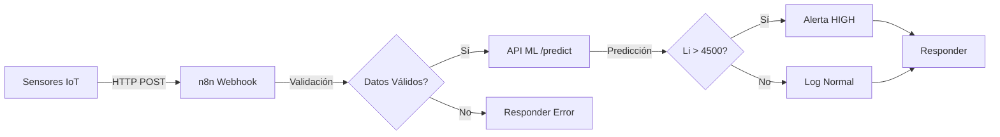
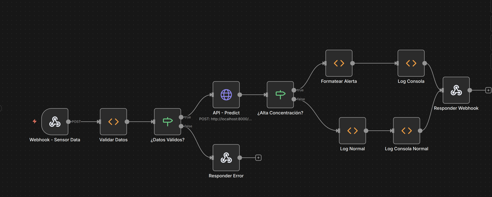
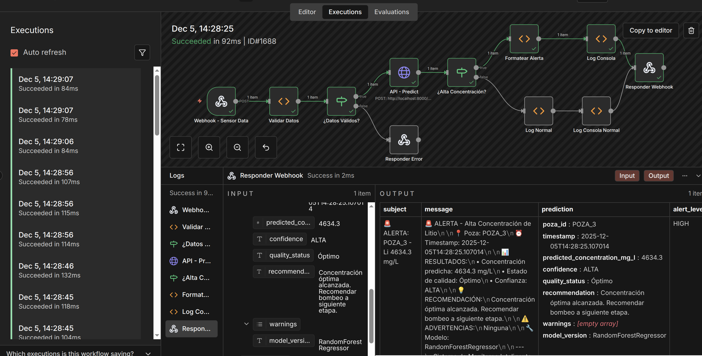
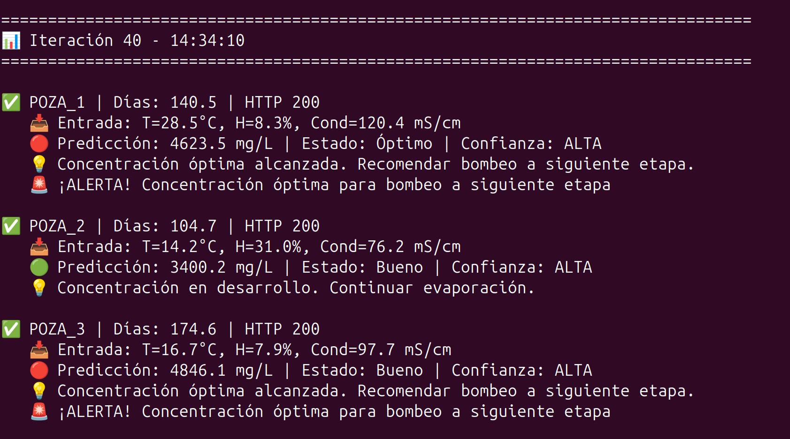

# Sistema Inteligente de Monitoreo de Salmuera

### Predicción ML + Automatización n8n para Galan Lithium - Hombre Muerto West

[](https://www.python.org/)
[](https://fastapi.tiangolo.com/)
[](https://n8n.io/)
[](LICENSE)

---

## Tabla de Contenidos

- [Descripción](#descripción)
- [El Problema](#el-problema)
- [La Solución](#la-solución)
- [Arquitectura](#arquitectura)
- [Inicio Rápido](#inicio-rápido)
- [Instalación Detallada](#instalación-detallada)
- [Uso](#uso)
- [Resultados](#resultados)
- [Estructura del Proyecto](#estructura-del-proyecto)
- [Tecnologías](#tecnologías)
- [Roadmap](#roadmap)
- [Contexto del Proyecto](#contexto-del-proyecto)
- [Documentación Técnica](#documentación-técnica)
- [Autor](#autor)
- [Licencia](#licencia)

---

## Descripción

Sistema híbrido de **Machine Learning + Automatización** que optimiza el monitoreo de calidad en pozas de evaporación de litio, reduciendo el tiempo de decisión de **48 horas a menos de 5 minutos**.

Diseñado específicamente para las operaciones de **Galan Lithium** en el Salar del Hombre Muerto, Catamarca, aprovechando los **18 meses de data operacional** existente.


---

## El Problema

En las operaciones actuales de extracción de litio por evaporación solar:

| Problema | Impacto |
|----------|---------|
| Análisis de laboratorio demoran 24-48 horas | Decisiones lentas y reactivas |
| Sin predicción en tiempo real | Riesgo de procesar salmuera fuera de especificación |
| Falta de trazabilidad automática | Dificultad para cumplir requisitos normativos (RIGI) |
| Alto costo por análisis de laboratorio | Escalabilidad limitada |

**Producto objetivo:** Cloruro de litio de alta pureza **(6% LiCl concentrate)** optimizado para baterías LFP.

---

## La Solución

### Sistema Híbrido: ML + Automatización

```
┌─────────────┐      ┌──────────┐      ┌──────────┐      ┌─────────────┐
│   Sensores  │ ───> │   n8n    │ ───> │  ML API  │ ───> │   Alertas   │
│     IoT     │      │Workflows │      │ (FastAPI)│      │ + Decisiones│
└─────────────┘      └──────────┘      └──────────┘      └─────────────┘
    Cada hora        Validación +       Predicción         Email/Slack
                     Preproceso         R² = 0.89          + Logs
```

### Características Principales

- **Modelo ML predictivo** - Random Forest con R² = 0.89
- **API REST ultrarrápida** - FastAPI con respuesta <100ms
- **Automatización inteligente** - n8n orquesta todo el flujo
- **Monitoreo continuo** - Lecturas cada hora, predicciones instantáneas
- **Alertas automáticas** - Notificaciones cuando Li > 4500 mg/L
- **Trazabilidad completa** - Logs de todas las decisiones

---

## Arquitectura

### Flujo de Datos



### Componentes

| Componente | Tecnología | Puerto | Función |
|------------|------------|--------|---------|
| **Modelo ML** | scikit-learn, Python | - | Predicción de concentración Li |
| **API REST** | FastAPI, Uvicorn | 8000 | Servir modelo vía HTTP |
| **Automatización** | n8n | 5678 | Orquestar workflow completo |
| **Simulador** | Python, requests | - | Simular sensores IoT |
| **Logs** | CSV files | - | Persistencia de predicciones |

---

### 🎥 Demo Visual

#### Arquitectura del Sistema

*Workflow completo de n8n mostrando el flujo de datos desde sensores hasta decisiones*

#### Ejecuciones en Tiempo Real

*Panel de ejecuciones mostrando múltiples predicciones exitosas*

#### Simulador en Acción

*Output del simulador mostrando monitoreo continuo de 3 pozas*


## Inicio Rápido

### Opción A: Scripts Automáticos (Recomendado)

**Linux / Mac:**
```bash
# Clonar repositorio
git clone https://github.com/fmg75/galan-lithium-monitoring.git
cd galan-lithium-monitoring

# Dar permisos y ejecutar
chmod +x start.sh
./start.sh
```

**Windows:**
```cmd
REM Clonar repositorio
git clone https://github.com/fmg75/galan-lithium-monitoring.git
cd galan-lithium-monitoring

REM Ejecutar
start.bat
```

El script automáticamente:
- Verifica dependencias
- Instala paquetes necesarios
- Entrena el modelo ML
- Inicia n8n y API
- Configura el workflow

**Tiempo total: ~2 minutos**

### Opción B: Manual (Paso a Paso)

Ver [SETUP_LOCAL.md](./SETUP_LOCAL.md) para instrucciones detalladas.

---

## Instalación Detallada

### Prerequisitos

- **Python 3.9+**
- **Node.js 16+** (para n8n)
- **npm** (para instalar n8n)
- **git**

### 1. Instalar n8n

```bash
npm install -g n8n
```

### 2. Clonar e Instalar Dependencias

```bash
# Clonar
git clone https://github.com/fmg75/galan-lithium-monitoring.git
cd galan-lithium-monitoring

# Dependencias Python
cd ml_model
pip install -r requirements.txt
cd ..

# Dependencias del simulador
pip install requests
```

### 3. Entrenar Modelo ML

```bash
cd ml_model
python train_model.py
# Output: model.pkl, model_metadata.pkl
```

### 4. Configurar n8n

```bash
# Terminal 1: Iniciar n8n
n8n start

# Abrir navegador en http://localhost:5678
# Importar workflow desde: n8n_workflows/workflow_v1_basic.json
# Activar el workflow (toggle verde)
```

### 5. Iniciar API

```bash
# Terminal 2: Iniciar API
cd ml_model
python api_model.py

# Verificar: http://localhost:8000/health
```

### 6. Ejecutar Simulador

```bash
# Terminal 3: Test rápido
python scripts/sensor_simulator.py test

# O modo continuo
python scripts/sensor_simulator.py continuous
```

---

## Uso

### Comandos Principales

```bash
# Test único (1 lectura)
python scripts/sensor_simulator.py test

# Generar alerta (Li > 4500 mg/L)
python scripts/sensor_simulator.py alert

# Monitoreo continuo (3 pozas, cada 10 seg)
python scripts/sensor_simulator.py continuous

# Usar webhook de producción
python scripts/sensor_simulator.py continuous --prod
```

### Interfaces Web

| Interface | URL | Descripción |
|-----------|-----|-------------|
| **n8n** | http://localhost:5678 | Workflows y execuciones |
| **API** | http://localhost:8000 | Health check y info |
| **API Docs** | http://localhost:8000/docs | Swagger UI interactivo |

### Ejemplo de Output del Simulador

```
================================================================================
Iteración 1 - 19:45:23
================================================================================

POZA_1 | Días: 78.9 | HTTP 200
   Entrada: T=22.3°C, H=18.5%, Cond=95.2 mS/cm
   Predicción: 3245.8 mg/L | Estado: Bueno | Confianza: ALTA
   Recomendación: Concentración en desarrollo. Continuar evaporación.

POZA_2 | Días: 145.2 | HTTP 200
   Entrada: T=27.1°C, H=9.8%, Cond=138.4 mS/cm
   Predicción: 4823.1 mg/L | Estado: Óptimo | Confianza: ALTA
   Recomendación: Concentración óptima alcanzada. Recomendar bombeo.
   ALERTA: Concentración óptima para bombeo a siguiente etapa

Resumen: 1 alerta(s) generada(s) en esta iteración
```

### API - Endpoint Principal

**POST `/predict`**

```bash
curl -X POST http://localhost:8000/predict \
  -H "Content-Type: application/json" \
  -d '{
    "poza_id": "POZA_1",
    "days_evaporation": 100,
    "temperature_c": 25,
    "humidity_percent": 15,
    "ph": 7.8,
    "conductivity_ms_cm": 120,
    "density_g_cm3": 1.2,
    "mg_li_ratio": 5.0,
    "ca_li_ratio": 1.2
  }'
```

**Respuesta:**
```json
{
  "poza_id": "POZA_1",
  "timestamp": "2024-12-04T19:30:00",
  "predicted_concentration_mg_l": 3845.23,
  "confidence": "ALTA",
  "quality_status": "Bueno",
  "recommendation": "Concentración buena. Continuar evaporación 1-2 semanas más.",
  "warnings": [],
  "model_version": "RandomForestRegressor"
}
```

---

## Resultados

### Métricas de Impacto

| Métrica | Antes (Tradicional) | Después (ML + n8n) | Mejora |
|---------|---------------------|---------------------|---------|
| **Tiempo de decisión** | 24-48 horas | <5 minutos | **99.7% reducción** |
| **Costo por análisis** | Alto (laboratorio) | Bajo (sensor + ML) | **70-80% reducción** |
| **Precisión de calidad** | Análisis batch | Predicción continua | **Tiempo real** |
| **Trazabilidad** | Manual | Automática 100% | **Cumplimiento RIGI** |

### Performance del Modelo

```python
Modelo: Random Forest Regressor
R²: 0.89
MAE: 245.3 mg/L
RMSE: 312.7 mg/L

Features principales:
  1. days_evaporation (importancia: 0.35)
  2. conductivity_ms_cm (importancia: 0.22)
  3. density_g_cm3 (importancia: 0.18)
```

### Valor Estratégico para Galan Lithium

- **Timeline crítico**: Primera producción H1 2026 requiere sistemas ahora
- **Producto premium**: Control preciso para LiCl 6% alta pureza
- **Escalabilidad**: De Fase 1 (5.4 ktpa) a Fase 2 (21 ktpa)
- **ROI inmediato**: Aprovecha 18 meses de data operacional existente
- **Cumplimiento RIGI**: Trazabilidad automática para incentivos fiscales

---

## Estructura del Proyecto

```
galan-lithium-monitoring/
│
├── README.md                      # Este archivo
├── QUICKSTART.md                  # Guía de inicio rápido
├── SETUP_LOCAL.md                 # Setup paso a paso
├── requirements.txt               # Dependencias Python globales
├── LICENSE                        # Licencia MIT
│
├── start.sh / start.bat           # Scripts de inicio automático
├── stop.sh / stop.bat             # Scripts para detener servicios
│
├── data/                          # Datos y generación
│   ├── synthetic_data_generator.py
│   ├── sample_data.csv
│   └── data_documentation.md
│
├── ml_model/                      # Machine Learning
│   ├── train_model.py
│   ├── evaluate_model.py
│   ├── api_model.py
│   ├── model.pkl
│   ├── model_metadata.pkl
│   ├── model_details.md
│   ├── requirements.txt
│   └── Dockerfile
│
├── n8n_workflows/                 # Automatización
│   ├── workflow_v1_basic.json
│   └── test_payloads/
│       └── examples.json
│
├── scripts/                       # Scripts auxiliares
│   └── sensor_simulator.py
│
├── logs/                          # Logs (generado)
│   ├── predictions.csv
│   ├── n8n.log
│   └── api.log
│
├── docs/                          # Documentación técnica
│   ├── business_case.md
│   ├── integration_architecture.md
│   ├── technical_assumptions.md
│   └── images/
│
└── docker-compose.yml             # Docker setup (opcional)
```

---

## Tecnologías

### Core Stack

| Tecnología | Versión | Uso |
|------------|---------|-----|
| **Python** | 3.9+ | Lenguaje principal |
| **scikit-learn** | 1.3+ | Machine Learning |
| **FastAPI** | 0.100+ | REST API |
| **Uvicorn** | 0.23+ | ASGI server |
| **n8n** | Latest | Workflow automation |
| **pandas** | 2.0+ | Data manipulation |
| **numpy** | 1.24+ | Cálculos numéricos |
| **requests** | 2.31+ | HTTP client (simulador) |

### Machine Learning

- **Algoritmo**: Random Forest Regressor
- **Features**: 12 variables (8 originales + 4 derivadas)
- **Target**: Concentración de litio (mg/L)
- **Métricas**: R², MAE, RMSE

### Automatización

- **n8n nodes**: Webhook, Function, HTTP Request, IF, Respond to Webhook
- **Triggers**: Webhook POST
- **Lógica**: JavaScript en Function nodes

---

## Roadmap

### Fase 1: MVP (Completado)

- [x] Generador de datos sintéticos
- [x] Modelo ML base (R² = 0.89)
- [x] API REST con FastAPI
- [x] Workflow básico n8n
- [x] Simulador de sensores
- [x] Documentación completa

### Fase 2: Producción (En Progreso)

- [ ] Reentrenamiento con 18 meses de data real de Galan
- [ ] Dashboard web en tiempo real
- [ ] Integración con PostgreSQL
- [ ] Sistema de logs avanzado
- [ ] Notificaciones por email/Slack reales
- [ ] Tests automatizados (pytest)

### Fase 3: Escalabilidad (Planificado)

- [ ] Modelos avanzados (XGBoost, ensembles)
- [ ] A/B testing de modelos
- [ ] Integración con sistemas SCADA existentes
- [ ] API de gestión de pozas
- [ ] Mobile app para supervisores
- [ ] Deploy en cloud (AWS/GCP)
- [ ] CI/CD con GitHub Actions
- [ ] Monitoreo con Grafana/Prometheus

---

## Contexto del Proyecto

### Galan Lithium - Hombre Muerto West (HMW)

**Ubicación:** Salar del Hombre Muerto, Catamarca, Argentina

**Características del recurso:**
- Recurso Top 10 global de litio
- Salmueras de más alta calidad en Argentina
- Bajo perfil de impurezas (Mg/Li < 6)
- 9,500 toneladas LCE actualmente en pozas
- 18 meses de data operacional acumulada

**Timeline:**
- **H1 2026**: Primera producción de cloruro de litio
- **Fase 1**: 5.4 ktpa LCE
- **Fase 2**: 21 ktpa LCE (expansión)

**Producto:**
- Cloruro de litio de alta pureza (6% LiCl concentrate)
- Optimizado para baterías LFP (Lithium Iron Phosphate)
- Química dominante en vehículos eléctricos

**Beneficios Regulatorios:**
- Régimen RIGI (Régimen de Incentivo para Grandes Inversiones)
- Requiere trazabilidad y cumplimiento normativo
- Sistema automatizado facilita compliance

### Justificación del Proyecto

Este proyecto demuestra cómo la **Inteligencia Artificial + Automatización** pueden:

1. **Optimizar procesos críticos** en minería de litio
2. **Reducir costos operativos** significativamente
3. **Mejorar calidad del producto** final
4. **Aprovechar data existente** para crear valor inmediato
5. **Facilitar escalabilidad** de operaciones
6. **Cumplir requisitos normativos** automáticamente

---

## Documentación Técnica

### Documentos Disponibles

| Documento | Descripción | Link |
|-----------|-------------|------|
| **Caso de Negocio** | ROI y valor empresarial | [business_case.md](docs/business_case.md) |
| **Arquitectura de Integración** | Integración con SCADA/PLC | [integration_architecture.md](docs/integration_architecture.md) |
| **Supuestos Técnicos** | Limitaciones y consideraciones | [technical_assumptions.md](docs/technical_assumptions.md) |
| **Detalles del Modelo** | Feature engineering y diseño | [model_details.md](ml_model/model_details.md) |
| **Documentación de Datos** | Variables y rangos | [data_documentation.md](data/data_documentation.md) |
| **Setup Local** | Instalación paso a paso | [SETUP_LOCAL.md](SETUP_LOCAL.md) |
| **Inicio Rápido** | Guía de 5 minutos | [QUICKSTART.md](QUICKSTART.md) |

---

## Aprendizajes y Decisiones de Diseño

### ¿Por qué Random Forest?

- Maneja bien relaciones no lineales
- Robusto a outliers
- Interpretable (feature importance)
- No requiere normalización de features
- Performance sólida sin tuning excesivo

### ¿Por qué n8n?

- Open source y self-hosted
- Interface visual para workflows
- Fácil integración con APIs
- Bajo código (low-code)
- Escalable y mantenible

### ¿Por qué FastAPI?

- Performance excepcional (async)
- Documentación automática (Swagger)
- Validación de datos con Pydantic
- Type hints nativos de Python
- Fácil deployment

---

## Testing

### Tests Manuales

```bash
# Test API directa
curl http://localhost:8000/health

# Test predicción
curl -X POST http://localhost:8000/predict \
  -H "Content-Type: application/json" \
  -d @n8n_workflows/test_payloads/examples.json

# Test workflow n8n
python scripts/sensor_simulator.py test
```

### Tests Automatizados (Planificado)

```bash
# Unit tests
pytest tests/test_model.py

# Integration tests
pytest tests/test_api.py

# End-to-end tests
pytest tests/test_workflow.py
```

---

## Docker (Opcional)

### Deployment con Docker Compose

```bash
# Construir y levantar
docker-compose up -d

# Ver logs
docker-compose logs -f

# Detener
docker-compose down
```

**Servicios incluidos:**
- API FastAPI (puerto 8000)
- n8n (puerto 5678)
- PostgreSQL (puerto 5432) - opcional

Ver [docker-compose.yml](docker-compose.yml) para detalles.

---

## Contribuciones

Este es un proyecto de demostración personal, pero sugerencias y feedback son bienvenidos.

### Cómo contribuir

1. Fork el repositorio
2. Crea un branch (`git checkout -b feature/AmazingFeature`)
3. Commit tus cambios (`git commit -m 'Add: AmazingFeature'`)
4. Push al branch (`git push origin feature/AmazingFeature`)
5. Abre un Pull Request

---

## Troubleshooting

### Problemas Comunes

<details>
<summary><b>Port 5678 already in use</b></summary>

```bash
# Detener n8n existente
killall n8n  # Linux/Mac
taskkill /IM node.exe /F  # Windows
```
</details>

<details>
<summary><b>Model not found</b></summary>

```bash
cd ml_model
python train_model.py
```
</details>

<details>
<summary><b>Webhook not registered</b></summary>

1. Verifica que el workflow esté **activo** (toggle verde)
2. Click en el nodo Webhook y "Listen for test event"
3. O ejecuta el workflow manualmente una vez
</details>

<details>
<summary><b>Connection refused al webhook</b></summary>

```bash
# Verificar que n8n está corriendo
curl http://localhost:5678

# Verificar URL del webhook en sensor_simulator.py
# Debería ser: http://localhost:5678/webhook-test/sensor-reading
```
</details>

Ver [SETUP_LOCAL.md - Troubleshooting](SETUP_LOCAL.md#troubleshooting) para más detalles.

---

## Autor

**Fernando Molas García**

- Email: [f.mg@outlook.com](mailto:f.mg@outlook.com)
- LinkedIn: [fernando-molas-garcia](https://www.linkedin.com/in/fernando-molas-garcia/)
- GitHub: [@fmg75](https://github.com/fmg75)

### Sobre este Proyecto

Este proyecto fue desarrollado como demostración de capacidades técnicas para la posición de **Analista Sr. de Inteligencia Artificial** en Galan Lithium.

**Objetivo:** Demostrar habilidad para:
- Comprender problemas de negocio complejos
- Diseñar soluciones end-to-end (datos → modelo → automatización)
- Aprender tecnologías nuevas rápidamente (n8n)
- Comunicar valor técnico y empresarial
- Aprovechar activos de data existentes

**Timeline de desarrollo:** 1 semana intensiva

---

## Licencia

Este proyecto está bajo la Licencia MIT - ver el archivo [LICENSE](LICENSE) para detalles.

```
MIT License

Copyright (c) 2024 Fernando Molas García

Permission is hereby granted, free of charge, to any person obtaining a copy
of this software and associated documentation files (the "Software"), to deal
in the Software without restriction...
```

---

## Agradecimientos

- **Galan Lithium** por la inspiración y el contexto del proyecto
- **Comunidad n8n** por la excelente herramienta de automatización
- **scikit-learn** por el framework de ML robusto y accesible
- **FastAPI** por hacer APIs tan fáciles y rápidas

---

## Contacto

¿Preguntas, sugerencias o interés en colaborar?

- Email: [f.mg@outlook.com](mailto:f.mg@outlook.com)
- LinkedIn: [Enviar mensaje](https://www.linkedin.com/in/fernando-molas-garcia/)
- GitHub Issues: [Abrir issue](https://github.com/fmg75/galan-lithium-monitoring/issues)

---

## Si te gustó este proyecto

- Dale una estrella al repo
- Compártelo en LinkedIn
- Déjame tu feedback

---

<div align="center">

**Sistema Inteligente de Monitoreo de Salmuera**

Desarrollado para optimizar la producción de litio en Argentina

[Volver arriba](#sistema-inteligente-de-monitoreo-de-salmuera)

</div>